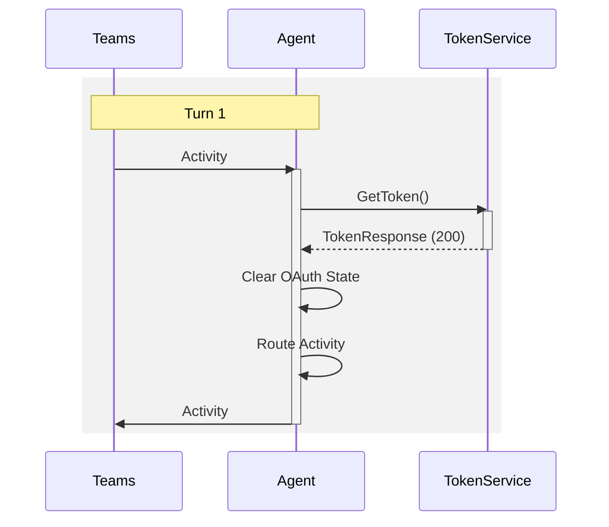
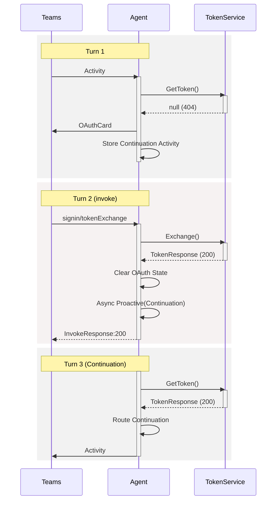
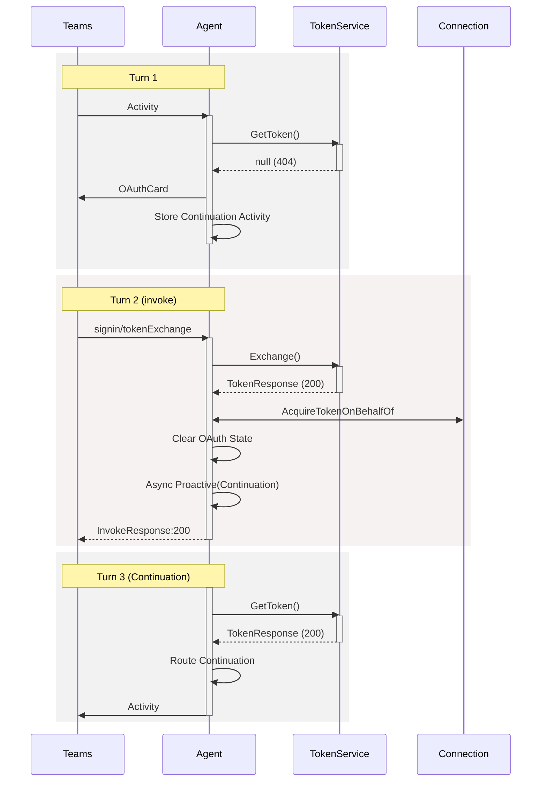
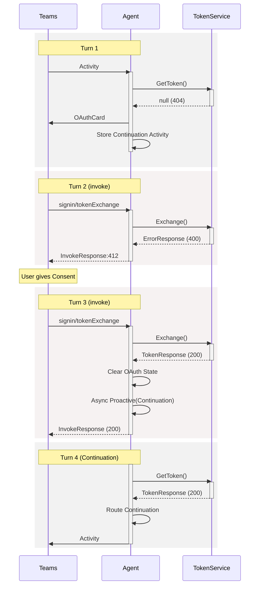
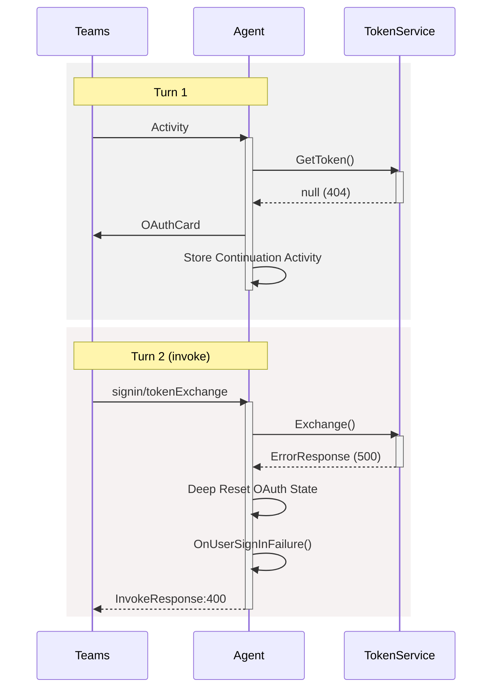

# Auto, SignedIn

```mermaid
sequenceDiagram
    participant Teams
    participant Agent
    participant TokenService

    %% turn 1
    rect rgba(128, 128, 128, .1)
    Note over Teams,Agent: Turn 1
    Teams->>Agent: Activity
    activate Agent
    Agent->>TokenService: GetToken()
    activate TokenService
    TokenService-->>Agent: TokenResponse (200)
    deactivate TokenService
    Agent->>Agent: Clear OAuth State
    Agent->>Agent: Route Activity
    Agent->>Teams: Activity
    deactivate Agent
    end
```

# Auto, Teams SSO, No ConsentRequired

```mermaid
sequenceDiagram
    participant Teams
    participant Agent
    participant TokenService

    %% turn 1
    rect rgba(128, 128, 128, .1)
    Note over Teams,Agent: Turn 1
    Teams->>Agent: Activity
    activate Agent
    Agent->>TokenService: GetToken()
    activate TokenService
    TokenService-->>Agent: null (404)
    deactivate TokenService
    Agent->>Teams: OAuthCard
    Agent->>Agent: Store Continuation Activity
    deactivate Agent
    end

    %% turn 2
    rect rgba(170, 128, 128, .1)
    Note over Teams, Agent: Turn 2 (invoke)
    Teams->>Agent: signin/tokenExchange
    activate Agent
    Agent->>TokenService: Exchange()
    activate TokenService
    TokenService-->>Agent: TokenResponse (200)
    deactivate TokenService
    Agent->>Agent: Clear OAuth State
    Agent->>Agent: Async Proactive(Continuation)
    Agent-->>Teams: InvokeResponse:200
    deactivate Agent
    end

    %% turn 3
    rect rgba(128, 128, 128, .1)
    Note over Agent,Teams: Turn 3 (Continuation)
    activate Agent
    Agent->>TokenService: GetToken()
    activate TokenService
    TokenService-->>Agent: TokenResponse (200)
    deactivate TokenService
    Agent->>Agent: Route Continuation
    Agent->>Teams: Activity
    deactivate Agent
    end
```

# Auto, Teams SSO, No ConsentRequired, With OBO

```mermaid
sequenceDiagram
    participant Teams
    participant Agent
    participant TokenService

    %% turn 1
    rect rgba(128, 128, 128, .1)
    Note over Teams,Agent: Turn 1
    Teams->>Agent: Activity
    activate Agent
    Agent->>TokenService: GetToken()
    activate TokenService
    TokenService-->>Agent: null (404)
    deactivate TokenService
    Agent->>Teams: OAuthCard
    Agent->>Agent: Store Continuation Activity
    deactivate Agent
    end

    %% turn 2
    rect rgba(170, 128, 128, .1)
    Note over Teams, Agent: Turn 2 (invoke)
    Teams->>Agent: signin/tokenExchange
    activate Agent
    Agent->>TokenService: Exchange()
    activate TokenService
    TokenService-->>Agent: TokenResponse (200)
    deactivate TokenService
    Agent<<->>Connection: AcquireTokenOnBehalfOf

    Agent->>Agent: Clear OAuth State
    Agent->>Agent: Async Proactive(Continuation)
    Agent-->>Teams: InvokeResponse:200
    deactivate Agent
    end

    %% turn 3
    rect rgba(128, 128, 128, .1)
    Note over Agent,Teams: Turn 3 (Continuation)
    activate Agent
    Agent->>TokenService: GetToken()
    activate TokenService
    TokenService-->>Agent: TokenResponse (200)
    deactivate TokenService
    Agent->>Agent: Route Continuation
    Agent->>Teams: Activity
    deactivate Agent
    end
```

# Auto, Teams SSO, ConsentRequired

```mermaid
sequenceDiagram
    participant Teams
    participant Agent
    participant TokenService

    %% turn 1
    rect rgba(128, 128, 128, .1)
    Note over Teams,Agent: Turn 1
    Teams->>Agent: Activity
    activate Agent
    Agent->>TokenService: GetToken()
    activate TokenService
    TokenService-->>Agent: null (404)
    deactivate TokenService
    Agent->>Teams: OAuthCard
    Agent->>Agent: Store Continuation Activity
    deactivate Agent
    end

    %% turn 2
    rect rgba(170, 128, 128, .1)
    Note over Teams, Agent: Turn 2 (invoke)
    Teams->>Agent: signin/tokenExchange
    activate Agent
    Agent->>TokenService: Exchange()
    activate TokenService
    TokenService-->>Agent: ErrorResponse (400)
    deactivate TokenService
    Agent-->>Teams: InvokeResponse:412
    deactivate Agent
    end

    Note over Teams: User gives Consent

    %% turn 3
    rect rgba(170, 128, 128, .1)
    Note over Teams, Agent: Turn 3 (invoke)
    Teams->>Agent: signin/tokenExchange
    activate Agent
    Agent->>TokenService: Exchange()
    activate TokenService
    TokenService-->>Agent: TokenResponse (200)
    deactivate TokenService
    Agent->>Agent: Clear OAuth State
    Agent->>Agent: Async Proactive(Continuation)
    Agent-->>Teams: InvokeResponse (200)
    deactivate Agent
    end

    %% turn 4
    rect rgba(128, 128, 128, .1)
    Note over Agent,Teams: Turn 4 (Continuation)
    activate Agent
    Agent->>TokenService: GetToken()
    activate TokenService
    TokenService-->>Agent: TokenResponse (200)
    deactivate TokenService
    Agent->>Agent: Route Continuation
    Agent->>Teams: Activity
    deactivate Agent
    end
```

# Auto, Teams SSO, Exchange failure

```mermaid
sequenceDiagram
    participant Teams
    participant Agent
    participant TokenService

    %% turn 1
    rect rgba(128, 128, 128, .1)
    Note over Teams,Agent: Turn 1
    Teams->>Agent: Activity
    activate Agent
    Agent->>TokenService: GetToken()
    activate TokenService
    TokenService-->>Agent: null (404)
    deactivate TokenService
    Agent->>Teams: OAuthCard
    Agent->>Agent: Store Continuation Activity
    deactivate Agent
    end

    %% turn 2
    rect rgba(170, 128, 128, .1)
    Note over Teams, Agent: Turn 2 (invoke)
    Teams->>Agent: signin/tokenExchange
    activate Agent
    Agent->>TokenService: Exchange()
    activate TokenService
    TokenService-->>Agent: ErrorResponse (500)
    deactivate TokenService
    Agent->>Agent: Deep Reset OAuth State
    Agent->>Agent: OnUserSignInFailure()
    Agent-->>Teams: InvokeResponse:400
    deactivate Agent
    end
```

